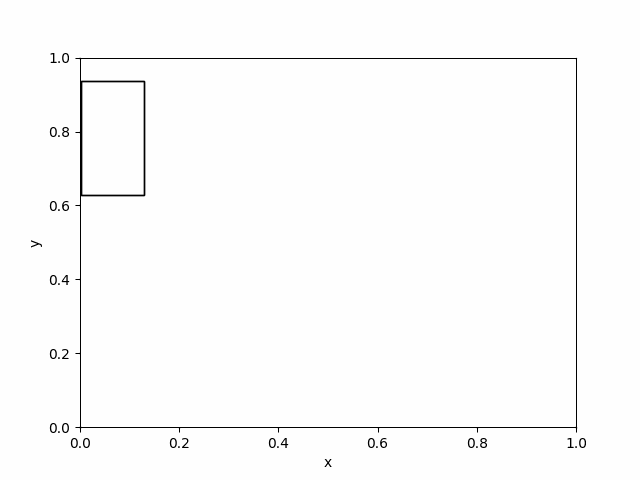

# Guttman's RTree
RTree based on [Guttman's](https://dl.acm.org/doi/10.1145/971697.602266) approach

Parameters
- m = 100
- M = 50

Dimension supported:
- 2D
- Already supports ND, require few tweaks

Operations supported:
- Insertion

Issues:
- Garbage collection not fully implemented

To Do:
- Deletion
- Quadratic pick seeds implemented, need to add linear pick seeds

Sample result : data/iot_devices.csv

